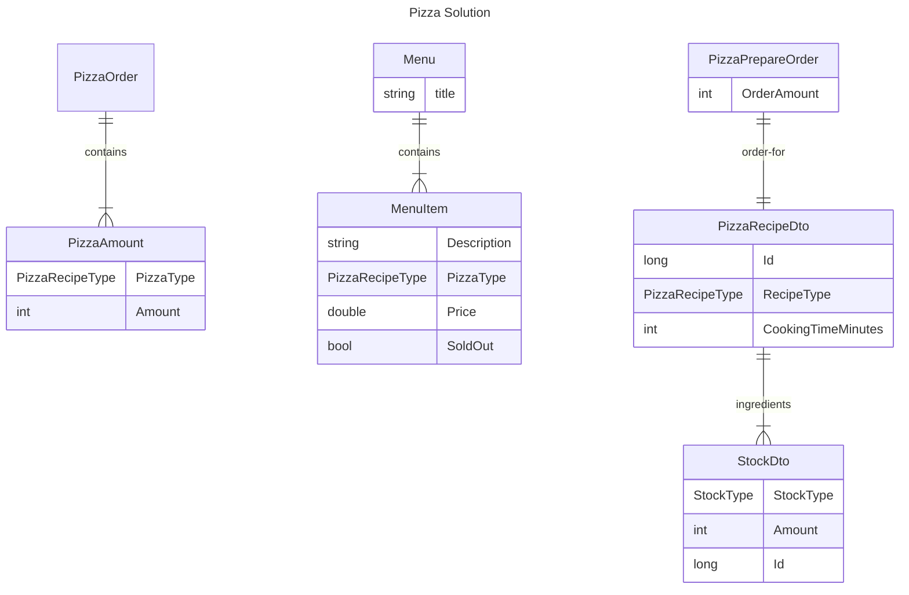

# Pizza

- PizzaRecipeType: enum
- StockType: enum

Vague kinda sketch:

```mermaid
---
title: Pizza Solution
---
erDiagram
    PizzaOrder ||--|{ PizzaAmount : contains
    PizzaAmount {
      PizzaRecipeType PizzaType
      int Amount
    }

    Menu {
      string title
    }
    MenuItem {
      string Description
      PizzaRecipeType PizzaType
      double Price
      bool SoldOut
    }
    Menu ||--|{ MenuItem : contains

    PizzaPrepareOrder {
      int OrderAmount
    }
    PizzaPrepareOrder ||--|| PizzaRecipeDto : order-for
    PizzaRecipeDto {
      long Id
      PizzaRecipeType RecipeType
      int CookingTimeMinutes      
    }
    PizzaRecipeDto ||--|{ StockDto : ingredients
    StockDto {
      StockType StockType
      int Amount
      long Id
    }
```
